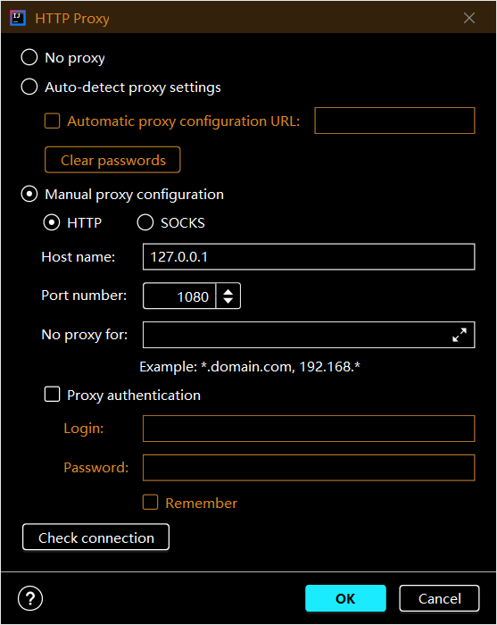

# Algorithm-practices (Java)

## Algorithms, [Part 1](https://www.coursera.org/learn/algorithms-part1/home/info) TODO list

- [x] 1st week (Union-Find, Algorithm Analysis)

  done, but can improve

- [x] 2nd week (Queues, Stacks, Elementary Sorts)

  done, will review in the future

- [x] 3rd week (Mergesort, Quicksort)

  done, but interview problems not really solved

- [ ] 4th week (Priority Queues, Elementary Symbol Tables)

  half done, 1 interview problem remain

- [ ] 5th week (Balanced Search Trees and its Geometric Applications)


- [ ] 6th week (Hash Tables, Symbol Table Applications)

## Algorithms, Part 2 (not yet)

nothing here

## A friendly reminder

When your IDE failed to fetch/push things, try to do these:

```
git config --global --unset http.proxy
git config --global --unset https.proxy
git config --global http.sslVerify "false"
```

This problem only happens ***somewhere in the world***, and I live there. So I wrote these to remind myself.

## A friendly reminder 2



In `%IDEA_Folder%/plugins/maven/lib/maven3/conf/settings.xml`

```xml
<!-- 最新阿里maven镜像库 https-->
<mirror>
  <id>aliyunmaven</id>
  <mirrorOf>*</mirrorOf>
  <name>阿里云公共仓库</name>
  <url>https://maven.aliyun.com/repository/public</url>
</mirror>
```
